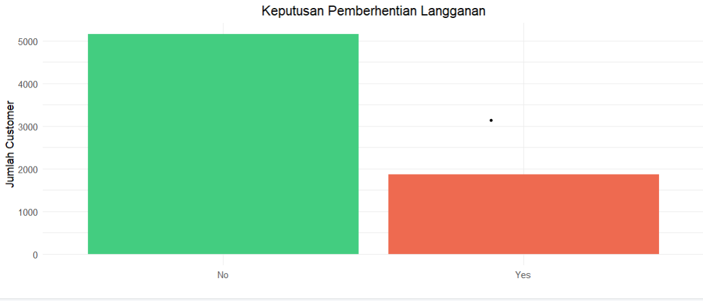

# Telco Customer Analysis

Proyek ini melakukan analisis terhadap data pelanggan Telco menggunakan R. Analisis mencakup pembersihan data, visualisasi, dan penerapan aturan asosiasi.

## Requirements

library r yang digunakan:


```R
library(caret)       # Pembersihan data
library(dplyr)       # Manipulasi data
library(tidyverse)   # Pengolahan data
library(ggplot2)     # Visualisasi data
library(reshape2)    # Mengubah bentuk data
library(GGally)      # Visualisasi tambahan untuk plot pasangan
library(arules)      # Membuat model asosiasi
library(arulesViz)   # Visualisasi untuk model asosiasi
```

## 1. Import Data 

Import dataset:

```R
data <- read.csv("C:/Users/anast/OneDrive/Documents/ITE/SEMESTER 3/DAP/telco_data.csv")

# Melihat struktur data
str(data)
head(data)
summary(data)
```

## 2. Data Cleaning

Mnegecek duplikat dan nilai yang hilang:

```R
# Mengecek data duplikat
data[duplicated(data) | duplicated(data, fromLast = TRUE)]

# Mengecek missing values
cat("Total data yang hilang:", sum(is.na(data)), "\n")
colSums(is.na(data))  # Missing values per kolom

# Menghapus baris dengan NA di kolom penting (misal: `TotalCharges`)
cust_bersih <- data[complete.cases(data), ]
cat("Nilai yang hilang setelah dibersihkan:", sum(is.na(cust_bersih)), "\n")
```

## 3. Mengubah Tipe Data dan Menyeragamkan Nama Kolom

Standarisasi nama kolom dan konversi tipe data:

```R
# Menyeragamkan nama kolom
names(cust_bersih)[names(cust_bersih) == "customerID"] <- "CustomerID"
names(cust_bersih)[names(cust_bersih) == "gender"] <- "Gender"
names(cust_bersih)[names(cust_bersih) == "tenure"] <- "Tenure"

# Mengubah `SeniorCitizen` menjadi kategori "No" dan "Yes"
cust_bersih$SeniorCitizen <- ifelse(cust_bersih$SeniorCitizen == 0, "No", "Yes")

# Transformasi tipe data numerik untuk TotalCharges jika diperlukan
cust_bersih$TotalCharges <- as.numeric(as.character(cust_bersih$TotalCharges))

# Daftar kolom yang akan dikonversi
cols_to_factor <- c("SeniorCitizen", "Partner", "Dependents", "PhoneService", 
                    "MultipleLines", "InternetService", "OnlineSecurity", 
                    "OnlineBackup", "DeviceProtection", "TechSupport", 
                    "StreamingTV", "StreamingMovies", "Contract", 
                    "PaperlessBilling", "PaymentMethod")

# Konversi kolom-kolom tersebut menjadi faktor
cust_bersih[cols_to_factor] <- lapply(cust_bersih[cols_to_factor], factor)

# Periksa apakah kolom telah dikonversi
str(cust_bersih)
```

## 4. Data Visualisasi

Buat berbagai visualisasi untuk memahami data:

```R
# Membuat grafik batang untuk kolom Churn
ggplot(cust_bersih, aes(x = Churn, fill = Churn)) +
  geom_bar() +
  labs(title = "Keputusan Pemberhentian Langganan", x = "", y = "Jumlah Customer") +
  theme_minimal() +
  scale_fill_manual(values = c("No" = "seagreen3", "Yes" = "coral2"))

#Berikut Hasil plot


# Distribusi churn berdasarkan Gender
ggplot(cust_bersih, aes(x = Gender, fill = Churn)) +
  geom_bar(position = "dodge") +
  labs(title = "Distribusi Churn Berdasarkan Gender", x = "Gender", y = "Jumlah Pelanggan") +
  theme_minimal()

# Boxplot MonthlyCharges berdasarkan Churn
ggplot(cust_bersih, aes(x = Churn, y = MonthlyCharges, fill = Churn)) +
  geom_boxplot() +
  labs(title = "Distribusi MonthlyCharges Berdasarkan Churn", x = "Churn", y = "Monthly Charges") +
  theme_minimal()

# Histogram Durasi Berlangganan berdasarkan Churn
ggplot(cust_bersih, aes(x = Tenure, fill = Churn)) +
  geom_histogram(binwidth = 5, color = "black", position = "dodge") +
  facet_wrap(~ Churn) +
  labs(title = "Keputusan Pemberhentian Langganan Berdasarkan Durasi Berlangganan (Bulan)",
       x = "Durasi Berlangganan (Bulan)", y = "Jumlah Customer") +
  theme_minimal()

# Histogram Jumlah Tagihan Per Bulan
ggplot(cust_bersih, aes(x = MonthlyCharges, fill = Churn)) +
  geom_histogram(binwidth = 5, color = "black", position = "dodge") +
  facet_wrap(~ Churn) +
  labs(title = "Keputusan Pemberhentian Langganan Berdasarkan Jumlah Tagihan Per Bulan",
       x = "Jumlah Tagihan Per Bulan", y = "Jumlah Customer") +
  theme_minimal()
```

## 5. Association Rules Analisis

```R
# Memilih kolom layanan untuk association rules
cust_bersih_1 <- cust_bersih %>% 
  select(PhoneService, InternetService, OnlineSecurity, OnlineBackup, 
         DeviceProtection, TechSupport, StreamingTV, StreamingMovies)

# Mengonversi data frame menjadi objek transaksi
cust_bersih_1.tr <- as(cust_bersih_1, "transactions")

# Membuat grafik frekuensi item
itemFrequencyPlot(cust_bersih_1.tr, topN = 15, type = "absolute", 
                   ylim = c(0, 7000), main = "Top 15 Layanan Telco", 
                   col = rainbow(15))

# Membuat aturan asosiasi (Rules umum)
freq.itemset <- apriori(cust_bersih_1, 
                         parameter = list(support = 0.3, conf = 0.8, 
                                          minlen = 2, target = "rules"))
inspect(freq.itemset)

# Aturan asosiasi dengan kombinasi "StreamingMovies"
rules1 <- apriori(cust_bersih_1, 
                  parameter = list(supp = 0.2, conf = 0.5, minlen = 2), 
                  appearance = list(default = "rhs", 
                                    lhs = c("StreamingMovies=Yes", "StreamingMovies=No")),
                  control = list(verbose = FALSE))
rules1 <- sort(rules1, decreasing = TRUE, by = "confidence")
inspect(rules1)

#Top Rules dengan Lift > 2
rules <- apriori(cust_bersih_1.tr, 
                 parameter = list(supp = 0.01, conf = 0.3, minlen = 2, target = "rules"))

#Filter rules dengan lift > 2
rules_lift <- subset(rules, lift > 2)

#Sort rules berdasarkan lift
rules_lift <- sort(rules_lift, by = "lift", decreasing = TRUE)

#Inspeksi Top 10 Rules dengan lift > 2
top_rules <- head(rules_lift, n = 10)
inspect(top_rules)
```

## 6. Rules Visualisasi

Visualisai untuk rules:

```R
# Visualisasi rules1
plot(rules1, method = "graph", control = list(type = "items"), 
     main = "Graph-Based Visualization of Rules")

# Scatter plot aturan asosiasi
plot(rules1, method = "grouped", main = "Grouped Matrix Plot of Rules")

# Visualisasi Top Rules
# Scatter plot
plot(rules, method = "scatterplot", measure = c("support", "confidence"), 
     shading = "lift", main = "Scatter Plot Rules")

# Graph plot
plot(rules, method = "graph", control = list(type = "items"), 
     main = "Graph Plot Rules")

# Grouped Matrix Plot
plot(rules, method = "grouped", main = "Grouped Matrix Plot Rules")
```


## Kesimpulan

### Faktor-Faktor Utama yang Mempengaruhi Churn

1. Durasi Berlangganan:
   - Pelanggan dengan durasi berlangganan pendek (0-20 bulan) memiliki risiko churn yang lebih tinggi
   - Pelanggan yang bertahan lebih lama (sekitar 60 bulan) menunjukkan loyalitas yang lebih tinggi
   - Periode kritis untuk retensi pelanggan adalah 20 bulan pertama

2. Monthly Charges:
   - Pelanggan yang churn memiliki rata-rata tagihan bulanan yang lebih tinggi (median 75-80)
   - Pelanggan yang bertahan memiliki tagihan bulanan yang lebih rendah (median 60-65)
   - Semakin tinggi biaya bulanan, semakin tinggi kemungkinan churn

3. Gender:
   - Tidak ada perbedaan signifikan dalam pola churn antara pelanggan pria dan wanita
   - Gender bukan merupakan faktor dominan dalam keputusan churn

### Pola Hubungan Layanan

 Association Rules Analysis menunjukkan:
   - Terdapat hubungan kuat antara penggunaan StreamingMovies dan PhoneService
   - Pelanggan tanpa layanan internet cenderung tidak menggunakan layanan tambahan
   - Rules dengan lift > 4 mengindikasikan korelasi kuat antar layanan tertentu

### Rekomendasi untuk Perusahaan

1. Program Retensi Pelanggan:
   - Fokus pada pelanggan yang tidak menggunakan PhoneService
   - Implementasi program khusus untuk 20 bulan pertama masa berlangganan
   - Pengembangan program loyalty reward untuk pelanggan >20 bulan

2. Strategi Layanan:
   - Menawarkan bundling layanan dengan kombinasi PhoneService, TechSupport, dan DeviceProtection
   - Meningkatkan edukasi tentang OnlineSecurity dan TechSupport, terutama untuk pelanggan DSL
   - Evaluasi struktur harga untuk pelanggan dengan monthly charges tinggi

3. Pengembangan Produk:
   - Desain paket layanan yang lebih terjangkau untuk periode awal berlangganan
   - Fokus pada edukasi manfaat layanan tambahan
   - Implementasi strategi cross-selling berdasarkan pola penggunaan layanan


